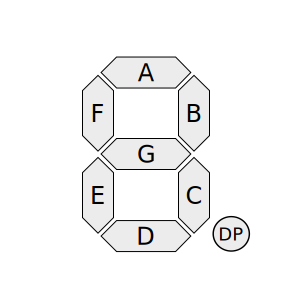

# Shift Seven

Johnny-Five module for controlling a seven segment display with a shift register.

Support this project by [donating on Gratipay](https://gratipay.com/scottgonzalez/).


## Getting Started

Shift Seven components must have the shift register pins connected to the seven segment pins in a specific order. Naming the shift register bits A - H, the pins should map to their same-named pins on the seven segment display, with H mapping to DP on the display.

*Note: The DP pin is not used for drawing any numbers. However, you may use this when drawing with a custom binary string via `ShiftSeven#write()`.*



Image source: [Wikipedia](https://en.wikipedia.org/wiki/Seven-segment_display#/media/File:7_segment_display_labeled.svg), licensed CC BY-SA 3.0


## API

### new ShiftSeven(options)

Creates a new `ShiftSeven` instance.

* `options` (Object): The options for initializing the display.
	* `pins` (Object): The pins for the shift register.
		* `data` (Number): The data pin.
		* `clock` (Number): The clock pin.
		* `latch` (Number): The latch pin.
	* `board` (Object; optional): Which board the shift register is connected to.

```js
var display = new ShiftSeven({
	pins: {
		data: 2,
		clock: 3,
		latch: 4
	}
});
```

### ShiftSeven#draw(number)

Draws a number on the seven segment display.

* `number` (Number): The number to draw, from 0 to 9.

```js
display.draw(5);
```

### ShiftSeven#write(value)

Draws the specified segments on the display.

* `value` (String|Number): A bitmask or eight character binary string representing the segments to draw.
	* The string form must contain only `0`s (for off) and `1`s (for on). The string is ordered the same as the shift register, from pins A - H (A - G, DP on the display).

```js
display.write("11101110");
// or
display.write(238);
```

### ShiftSeven#off()

Turns off the display.

```js
display.off();
```

### new ShiftSeven.Multi(options)

Creates a new `ShiftSeven.Multi` instance to create a multi-digit display from multiple shift register/seven segment display pairs.

* `options` (Object): The options for initializing the display.
	* `leadingZeros` (Boolean; optional; default: `false`): Whether leading zeros should be written when the currently drawn number doesn't require all segments.
	* `displays` (Array): Array of `ShiftSeven` options for each individual shift register/seven segment display pair.

```js
var display = new ShiftSeven.Multi({
	leadingZeros: true,
	displays: [
		{
			pins: {
				data: 2,
				clock: 3,
				latch: 4
			}
		},
		{
			pins: {
				data: 8,
				clock: 9,
				latch: 10
			}
		}
	]
});
```

### ShiftSeven.Multi#draw(number)

Draws a number on the seven segment displays.

* `number` (Number): The number to draw, from 0 to 10^(display count) - 1.

```js
display.draw(25);
```

### ShiftSeven.Multi#off()

Turns off the display.

```js
display.off();
```


## License

Copyright Scott González. Released under the terms of the MIT license.

---

Support this project by [donating on Gratipay](https://gratipay.com/scottgonzalez/).
